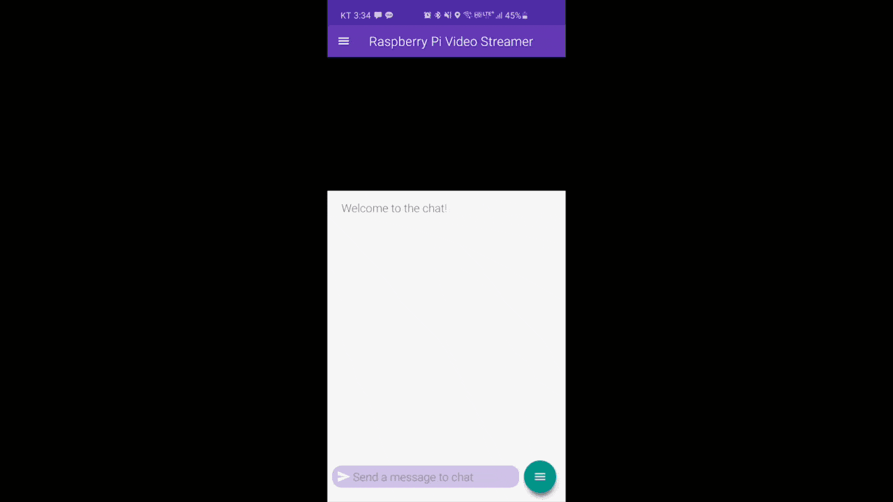
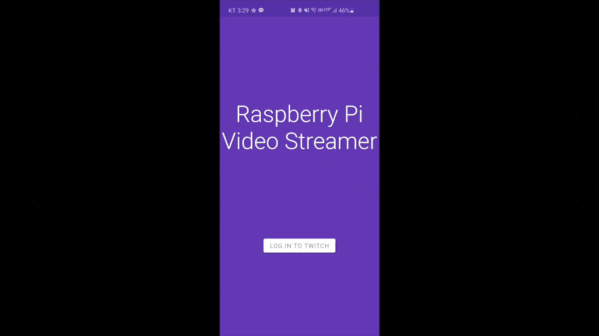
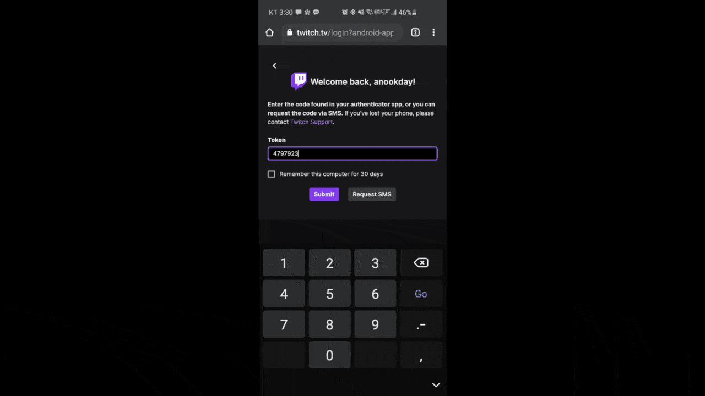
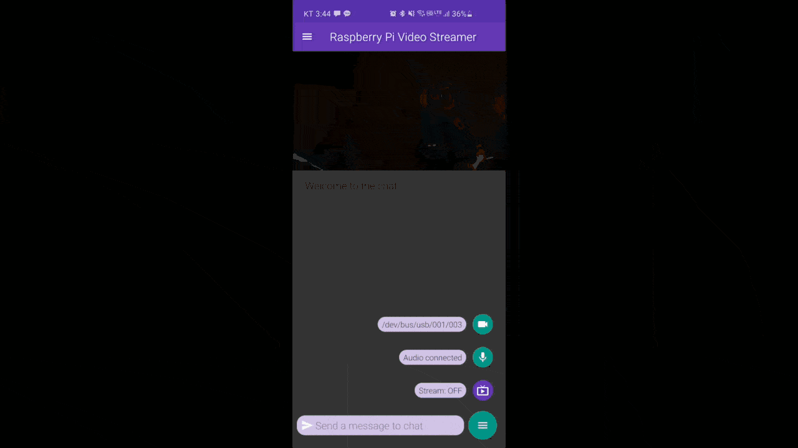
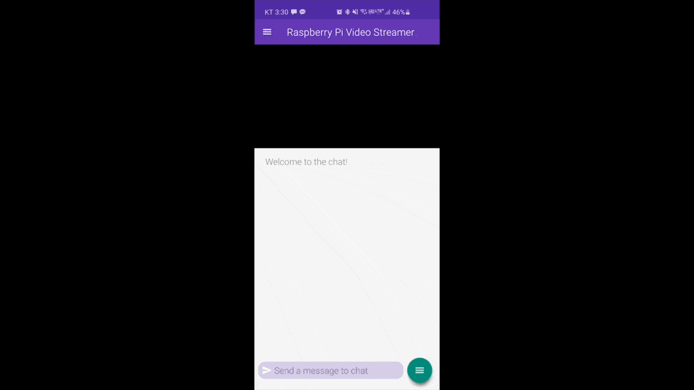

# Raspberry Pi Video Streamer
Connect a Raspberry Pi w/ a camera module to an Android device and stream the video buffer to your favorite streaming site.


## Demonstration

### Video Demos
Stream footage from Twitch exported to YouTube:
* [Stream test](https://youtu.be/HH8--Y9alM4)
* [Brewing coffee](https://youtu.be/JZYzalgvrYE) 

### UI Examples
#### Connecting to Twitch OAuth2

#### Logging In

#### Starting the Stream

#### Configuring Settings


## Raspberry Pi Setup

### 1. Enabling OTG
We need to edit some files on Raspberry Pi's boot disk. Navigate to your Raspberry Pi image (eg. `/Volumes/boot` on Mac). Add the following line at the bottom of `config.txt`:
```
dtoverlay=dwc2
```
In `cmdline.txt`, add the following after the word `rootwait`:
```
modules-load=dwc2,libcomposite
```
To enable ssh over wifi, create a file called `ssh` in the `boot` image by running the command:
```
touch ssh
```
Create a file called `wpa_supplicant.conf` with the following contents, replacing `COUNTRY_CODE`, `WIFI_NAME` and `WIFI_PASSWORD` with their respective contents:
```
ctrl_interface=DIR=/var/run/wpa_supplicant GROUP=netdev
update_config=1
country=COUNTRY_CODE

network={
     ssid="WIFI_NAME"
     psk="WIFI_PASSWORD"
     key_mgmt=WPA-PSK
}
```

### 2. SSH into Raspberry Pi
Connect your Raspberry Pi Zero to your phone via the <b>USB</b> (NOT PWR) port on the Pi. The first boot may take a few minutes. Once your Pi is fully booted, you can SSH into your Pi over wifi. Find your Pi's ip address and execute the following, replacing `IP_ADDRESS` with that of the Pi:
```
ssh-keygen -R IP_ADDRESS
ssh pi@IP_ADDRESS
```

### 3. Enable Camera
Connect your camera module to the Raspberry Pi if you already haven't done so. Then, you can find the menu to enable the camera by running the command:
```
sudo raspi-config
```

### 4. Configure Pi as a UVC Gadget
Check out a forked version of uvc-gadget:
```
cd /home/pi
git clone https://github.com/climberhunt/uvc-gadget.git
```
This repository provides a script that creates a systemd service. To install this, copy the file to the specified location and enable it.
```
cd uvc-gadget
sudo cp piwebcam.service /etc/systemd/system/
sudo systemctl enable piwebcam
```
Now, we build the uvc-gadget app. While you are in the /uvc-gadget directory, compile the repository code:
```
make
```
Enable serial connection (for app-to-pi communication):
```
sudo ln -s /lib/systemd/system/getty@.service /etc/systemd/system/getty.target.wants/getty@ttyGS0.service
sudo systemctl enable getty@ttyGS0.service
```
Restart your Raspberry Pi. Upon next boot, your Raspberry Pi should be set up as a USB camera gadget.

More information can be found at the following links:
https://www.raspberrypi.org/forums/viewtopic.php?t=148361
http://www.davidhunt.ie/raspberry-pi-zero-with-pi-camera-as-usb-webcam/

## Building the Android App

### 1. Download NDK
This app has been tested with NDK version 14 which you cannot donwload directly from Android Studio. Google provides download mirrors for older versions of NDK (<16) in the following link: 
https://developer.android.com/ndk/downloads/older_releases

Some modifications need to be made in the downloaded ndk. From the root directory of the NDK, change the file name of `prebuilt/YOUR_CHIP_ARCHITECTURE/bin/awk.exe` to `awk_.exe`, replacing `YOUR_CHIP_ARCHITECTURE` with your local machine's CPU architecture (eg. darwin_x86, armv6, etc.).

### 2. Compile in Android Studio
Clone this repository to your desired location and open the "rpistream" directory in Android Studio. Then, add the following line at the botoom of file "local.properties":
```
ndk.dir={NDK_LOCATION}
```
Make sure to substitute {NDK_LOCATION} with the correct path to the NDK directory.
Then, in Android Studio, go to Build > Rebuild Project and wait for the project to finish building. After, Run the "App" module on your Android device.

## Troubleshooting
#### 1. Service Not Running
On your Raspberry Pi check that the piwebcam service is running by using the command `systemctl | grep piwebcam`

If it's not then you can view the service logs using the command `journalctl -u piwebcam.service` to find the root problem.

A common problem may be that `dev/video0` is not being detected as a video device. A fix for this may be to run the command `echo "bcm2835-v4l2" | sudo tee -a /etc/modules`.

## License
Copyright 2021 anookday

 Licensed under the Apache License, Version 2.0 (the "License");
 you may not use this file except in compliance with the License.
 You may obtain a copy of the License at

     http://www.apache.org/licenses/LICENSE-2.0

 Unless required by applicable law or agreed to in writing, software
 distributed under the License is distributed on an "AS IS" BASIS,
 WITHOUT WARRANTIES OR CONDITIONS OF ANY KIND, either express or implied.
 See the License for the specific language governing permissions and
 limitations under the License.
 
## Third Party Libraries
This project uses saki4510t's libraries in their UVCCamera repository, licensed under Apache 2.0 License.
https://github.com/saki4510t/UVCCamera

All other libraries are included in the build.gradle files and can be viewed in-app via Google's OSS Licenses Gradle Plugin.
